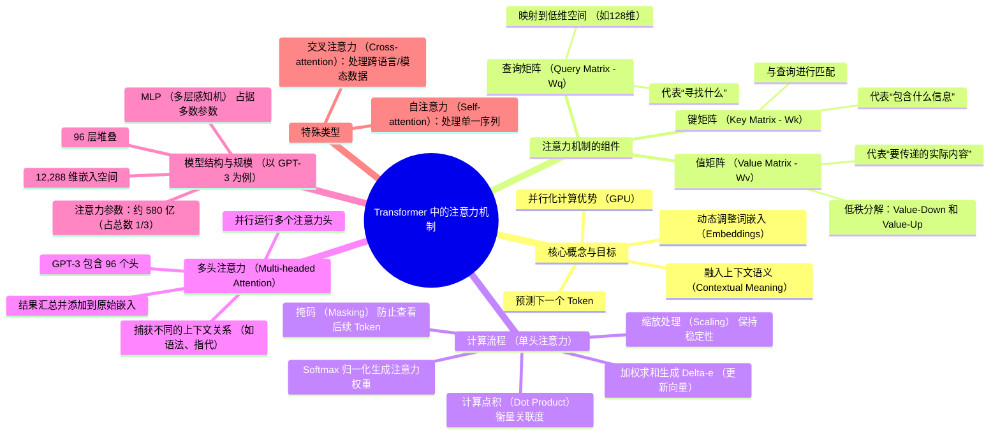

## 图谱（Obsidian 预览中打开）

```mermaid
mindmap
root((Transformer 中的注意力机制))
  核心概念与目标
    预测下一个 Token
    动态调整词嵌入 （Embeddings）
    融入上下文语义 （Contextual Meaning）
    并行化计算优势 （GPU）
  注意力机制的组件
    查询矩阵 （Query Matrix - Wq）
      代表“寻找什么”
      映射到低维空间 （如128维）
    键矩阵 （Key Matrix - Wk）
      代表“包含什么信息”
      与查询进行匹配
    值矩阵 （Value Matrix - Wv）
      代表“要传递的实际内容”
      低秩分解：Value-Down 和 Value-Up
  计算流程 （单头注意力）
    计算点积 （Dot Product） 衡量关联度
    缩放处理 （Scaling） 保持稳定性
    Softmax 归一化生成注意力权重
    加权求和生成 Delta-e （更新向量）
    掩码 （Masking） 防止查看后续 Token
  多头注意力 （Multi-headed Attention）
    并行运行多个注意力头
    捕获不同的上下文关系 （如语法、指代）
    GPT-3 包含 96 个头
    结果汇总并添加到原始嵌入
  模型结构与规模 （以 GPT-3 为例）
    96 层堆叠
    12,288 维嵌入空间
    注意力参数：约 580 亿 （占总数 1/3）
    MLP （多层感知机） 占据多数参数
  特殊类型
    自注意力 （Self-attention）：处理单一序列
    交叉注意力 （Cross-attention）：处理跨语言/模态数据
```

## 与 Wiki 的链接

<!-- Stage C 完成后自动补充 wikilinks -->
