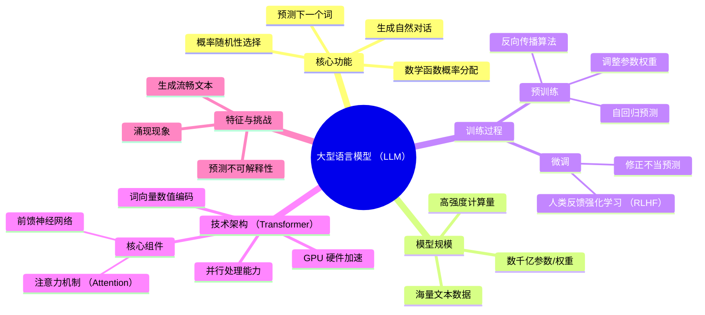

## 图谱（Obsidian 预览中打开）

```mermaid
mindmap
root((大型语言模型 （LLM）))
  核心功能
    预测下一个词
    数学函数概率分配
    生成自然对话
    概率随机性选择
  模型规模
    海量文本数据
    数千亿参数/权重
    高强度计算量
  训练过程
    预训练
      自回归预测
      反向传播算法
      调整参数权重
    微调
      人类反馈强化学习 （RLHF）
      修正不当预测
  技术架构 （Transformer）
    并行处理能力
    词向量数值编码
    核心组件
      注意力机制 （Attention）
      前馈神经网络
    GPU 硬件加速
  特征与挑战
    涌现现象
    预测不可解释性
    生成流畅文本
```

## 与 Wiki 的链接

<!-- Stage C 完成后自动补充 wikilinks -->
