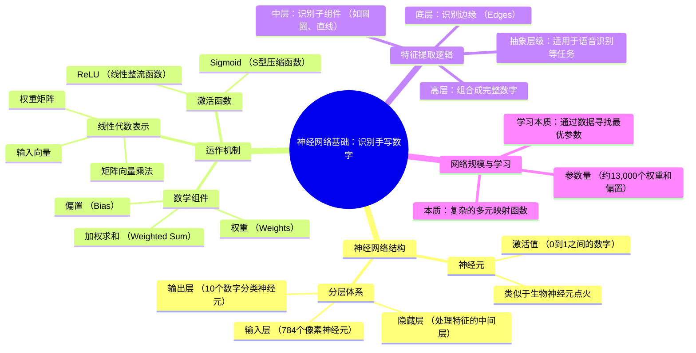

## 图谱（Obsidian 预览中打开）

```mermaid
mindmap
root((神经网络基础：识别手写数字))
  神经网络结构
    神经元
      激活值 （0到1之间的数字）
      类似于生物神经元点火
    分层体系
      输入层 （784个像素神经元）
      隐藏层 （处理特征的中间层）
      输出层 （10个数字分类神经元）
  运作机制
    数学组件
      权重 （Weights）
      偏置 （Bias）
      加权求和 （Weighted Sum）
    激活函数
      Sigmoid （S型压缩函数）
      ReLU （线性整流函数）
    线性代数表示
      权重矩阵
      输入向量
      矩阵向量乘法
  特征提取逻辑
    底层：识别边缘 （Edges）
    中层：识别子组件 （如圆圈、直线）
    高层：组合成完整数字
    抽象层级：适用于语音识别等任务
  网络规模与学习
    参数量 （约13,000个权重和偏置）
    学习本质：通过数据寻找最优参数
    本质：复杂的多元映射函数
```

## 与 Wiki 的链接

<!-- Stage C 完成后自动补充 wikilinks -->
